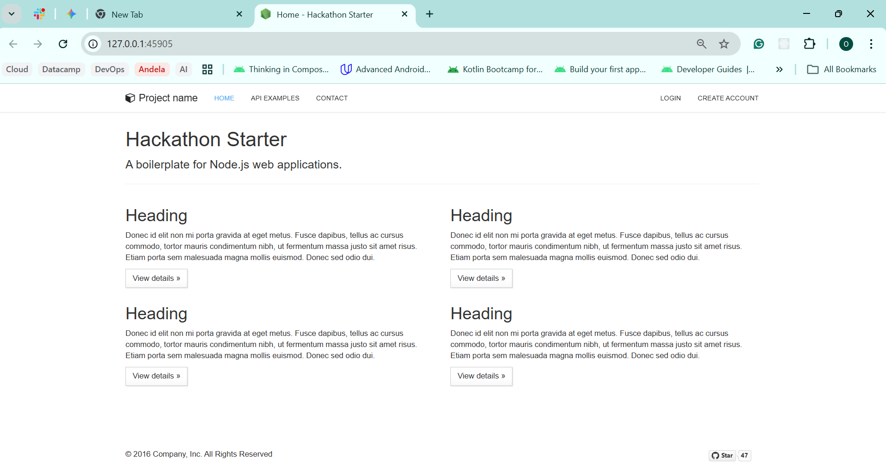
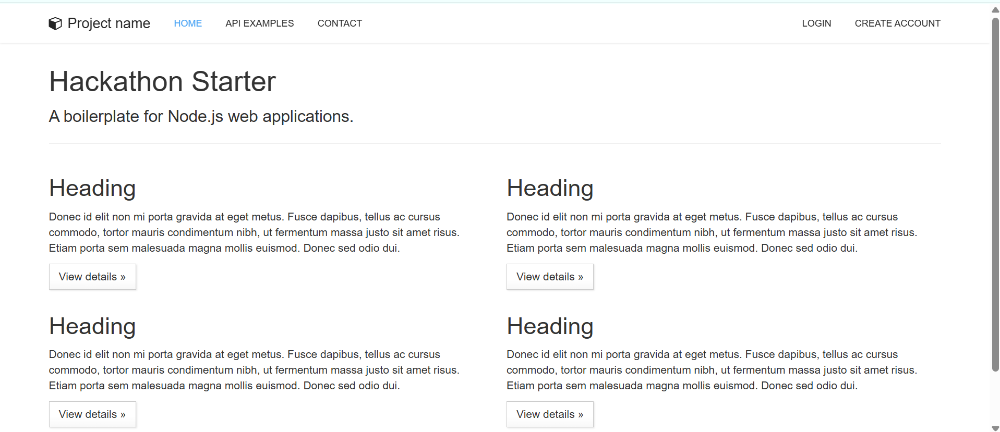

# 3-Tier TypeScript Express Starter (K8s Edition)

This is a production-ready containerized version of the Express TypeScript Starter, deployed as a 3-tier architecture (Frontend/Assets, Node.js Backend, and MongoDB Database) on Kubernetes.

## Architecture Overview
* **Tier 1:** Static assets and Pug views served via Express.
* **Tier 2:** Node.js (v14) Backend running on a clustered Kubernetes Deployment.
* **Tier 3:** MongoDB database tier with service discovery.

---

## Prerequisites
* **Docker Desktop** (WSL2 backend recommended)
* **Minikube**
* **kubectl**

---

##  Getting Started

### 1. Build the Container
```bash
docker build -t test-build:v3 .
```

### 2. Load Image into Minikube
```bash
minikube image load test-build:v3
```

### 3. Setup Configuration (Secrets)
The application requires sensitive environment variables to be present in the cluster.
```bash
kubectl create secret generic app-secrets \
  --from-literal=SESSION_SECRET=your_secret_here \
  --from-literal=FACEBOOK_ID=your_id \
  --from-literal=FACEBOOK_SECRET=your_secret
```

---

## Deployment

Deploy the database and backend tiers using the provided manifests:

```bash
# Start Database Tier
kubectl apply -f database.yaml

# Start Backend Tier
kubectl apply -f backend.yaml
```



